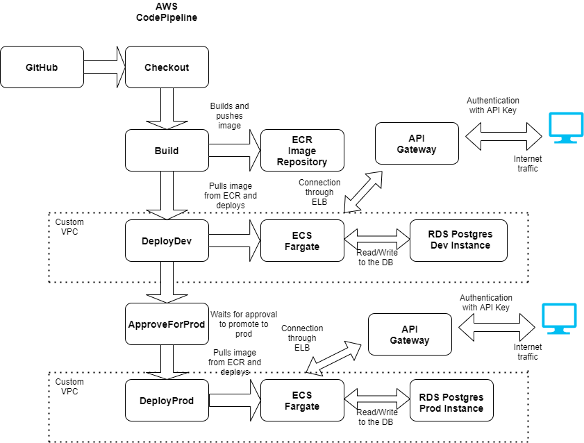

# cicd-fargate-rds-api-gateway

## The *`README.md`* is different for each branch. Please read the instructions carefully

Please follow the numbering on each branch to track the progress step by step.
**This branch is step number 2**

The workflow for step2 looks like this


## Changes from last step [1-codepipeline-fargate](https://github.com/S-Polimetla/cicd-fargate-rds-api-gateway/tree/1-codepipeline-fargate)

1. In the previous step, the application did not have a persistent database. For every rolling update through the CodePipeline, the container restarts with the new image version and all the data is lost.
2. The file [rds-database.yaml](./cloudformation-generic/rds-database.yaml) creates a RDS PostgreSQL database called `employee` within the same VPC. You have to do this for each stage.
3. The file [application.properties](./src/main/resources/application.properties) provides Springboot the necessary configuration to connect to the Database.
4. The database configuration is injected into the docker container during runtime using Fargate Secrets.

````
Secrets:
  - Name: DB_HOST
    ValueFrom: !Sub arn:aws:ssm:${AWS::Region}:${AWS::AccountId}:parameter/DataBaseCredentials/${Stage}/host
  - Name: DB_NAME
    ValueFrom: !Sub arn:aws:ssm:${AWS::Region}:${AWS::AccountId}:parameter/DataBaseCredentials/${Stage}/dbname
  - Name: DB_USERNAME
    ValueFrom: !Sub arn:aws:ssm:${AWS::Region}:${AWS::AccountId}:parameter/DataBaseCredentials/${Stage}/username
  - Name: DB_PASSWORD
    ValueFrom: !Sub arn:aws:ssm:${AWS::Region}:${AWS::AccountId}:parameter/DataBaseCredentials/${Stage}/password
````

The above is the relevant part where Fargate pulls secrets from SSM parameters.

This is similar to running
````
docker run -e VARIABLE1=value1 -p 8080:8080 <Your-Image-Name>:<Your-Tag>
````
5. The LoadBalancer here is public facing and has no security or validation for the incoming requests.  In the next step [3-elb-api-gateway](https://github.com/S-Polimetla/cicd-fargate-rds-api-gateway/tree/3-fargate-api-gateway), the ELB is set behind a API Gateway which is exposed to the API consumer instead of ELB DNS. The API consumer is authenticated using API Key.

### _Note_
The database created here is mapped to a custom domain name.  It is optional.

### If you are adding on to the previous step by just switching the branch for the pipeline stack, make sure you create the respective database(s) first. 

### If you are starting with the branch directly, here is the order of creation of resources

1. [network-config.yaml](./cloudformation-generic/network-config.yaml)
2. [rds-database.yaml](./cloudformation-generic/rds-database.yaml) twice. One for each environment
3. [build-pipeline-docker-ecs.yaml](./cloudformation-generic/build-pipeline-docker-ecs.yaml)